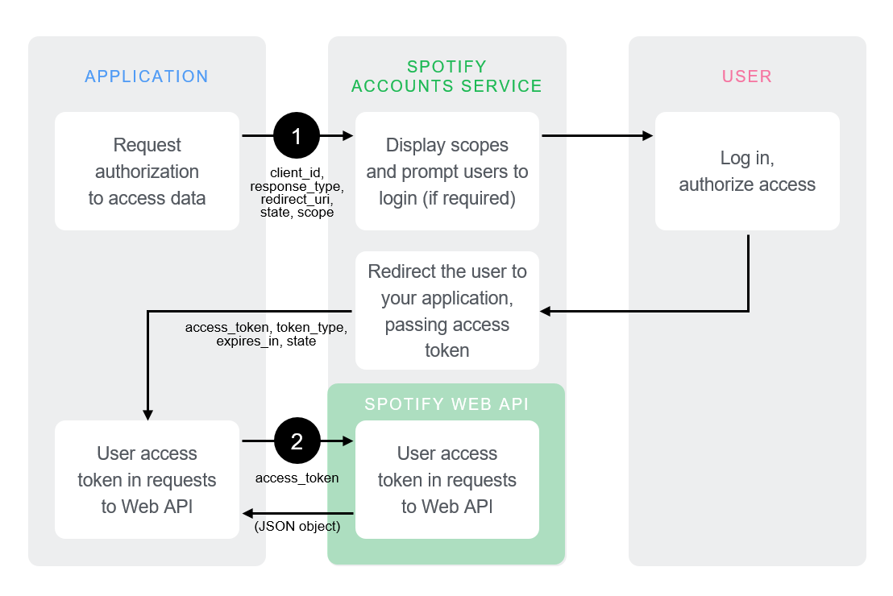

# Sporator


## Status
Link to project: https://sporator.netlify.com/

[](https://app.netlify.com/sites/sporator/deploys)


## Table of content 
 - Description
 - Project setup
 - API
    - Authentication
 - Licence


## Description
Sporator is an application that will fetch your top tracks from Spotify from the last 4 weeks and generate a playlist that will be added to your Spotify account.

## Project setup
1. Clone repo
2. Install all dependencies: ```npm install```
3. Compiles project for development: ```npm run serve```
4. Server will start at standard port: ```localhost:8080```
6. Change redirectUrl to ```http://localhost:8080/check``` for developing on local server. You can find this in the store.js file.
```
--state
    --authorizeUrl
        --redirectUrl
```
5. For production run: ```npm run build```

## Api 
This application use the official Spotify API. For full documentation of this API you can find it [here](https://developer.spotify.com/documentation/web-api/).

### Authentication
We will authenticate the user on the front-end, therefore we shall use the **Implicit Grand Flow** of the Authentication API.

Implicit grant flow is for clients that are implemented entirely using JavaScript and running in the resource owner’s browser. You do not need any server-side code to use it. Rate limits for requests are improved but there is no refresh token provided. This flow is described in [RFC-6749](https://tools.ietf.org/html/rfc6749#section-4.2).

- **You do** - You direct user to Spotify Accounts Service.
- **You get** - Access Token.

The Implicit Grant flow is carried out client-side and does not involve secret keys. The access tokens that are issued are short-lived and there are no refresh tokens to extend them when they expire.



#### Have the application request authorization
 - Redirect the user to the ```/authorize``` endpoint of the Accounts service:

 ```
 GET https://accounts.spotify.com/authorize
 ```

 The request will include parameters in the query string:


|QUERY PARAMETER|VALUE|
|---|---|
|client_id|Required.The client ID provided to you by Spotify when you register your application.|
|response_type|Required. Set it to “token”.|
|redirect_uri|Required. The URI to redirect to after the user grants/denies permission. This URI needs to be entered in the URI whitelist that you specify when you register your application.|
|state|Optional, but strongly recommended. The state can be useful for correlating requests and responses. Because your redirect_uri can be guessed, using a state value can increase your assurance that an incoming connection is the result of an authentication request. If you generate a random string or encode the hash of some client state (e.g., a cookie) in this state variable, you can validate the response to additionally ensure that the request and response originated in the same browser. This provides protection against attacks such as cross-site request forgery. See RFC-6749.|
|scope|	Optional. A space-separated list of scopes: see Using Scopes.|
|show_dialog|Optional. Whether or not to force the user to approve the app again if they’ve already done so. If false (default), a user who has already approved the application may be automatically redirected to the URI specified by redirect_uri. If true, the user will not be automatically redirected and will have to approve the app again.|

#### Example
You redirect the user:

```
https://accounts.spotify.com/authorize?client_id=5fe01282e94241328a84e7c5cc169164&redirect_uri=http:%2F%2Fexample.com%2Fcallback&scope=user-read-private%20user-read-email&response_type=token&state=123
```

This performs a couple of actions:

1. The user is asked to authorize access within the scopes. The Spotify Accounts service presents details of the scopes for which access is being sought.
 - If the user is not logged in, they are prompted to do so using their Spotify username and password.
 - When the user is logged in, they are asked to authorize access to the data sets defined in the scopes.
2. The user is redirected back to your specified URI. After the user grants (or denies) access, the Spotify Accounts service redirects the user to the ```redirect_uri```. In this example, the redirect address is: ```https://example.com/callback```

If the user grants access, the final URL will contain a hash fragment with the following data encoded as a query string. For example: ```https://example.com/callback#access_token=NwAExz...BV3O2Tk&token_type=Bearer&expires_in=3600&state=123```


|QUERY PARAMETER|VALUE|
| --- | --- |
|access_token|An access token that can be provided in subsequent calls, for example to Spotify Web API services.|
|token_type |Value: “Bearer”|
|expires_in |The time period (in seconds) for which the access token is valid.|
|state|	The value of the state parameter supplied in the request.

If the user denies access, access token is not included and the final URL includes a query string ```https://example.com/callback?error=access_denied&state=123```, containing the following parameters:

|QUERY PARAMETER|VALUE|
|---|---|
|error|	The reason authorization failed, for example: “access_denied”.|
|state|	The value of the state parameter supplied in the request.|

### Use the access token to access the Spotify Web API
The access token allows you to make requests to the Spotify Web API. For example, if you are using jQuery, you would do:

```
$.ajax({
   url: 'https://api.spotify.com/v1/me',
   headers: {
       'Authorization': 'Bearer ' + accessToken
   },
   success: function(response) {
       ...
   }
```

## Licence
License MIT

